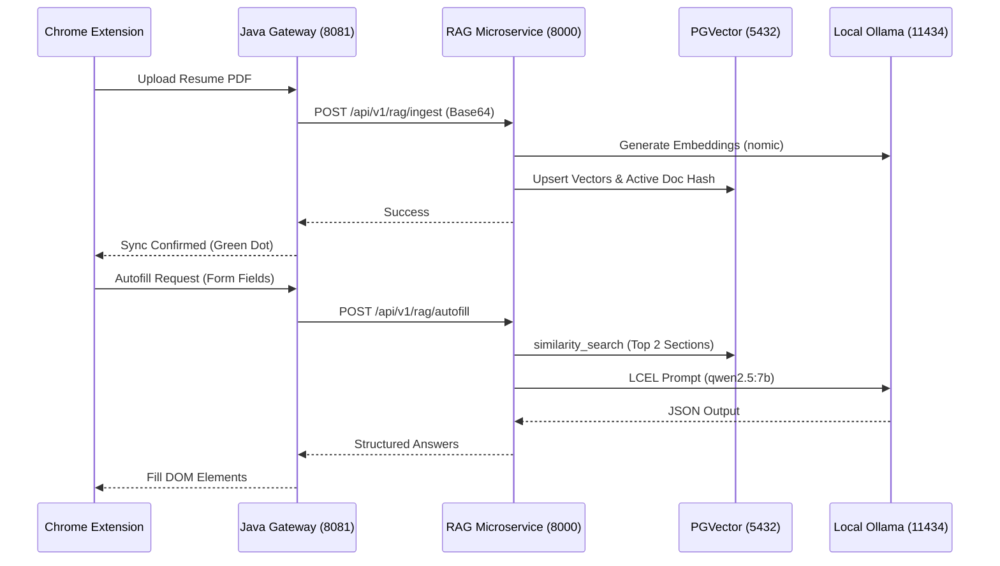

# RAG Architecture

This document outlines the LangChain-powered Retrieval-Augmented Generation (RAG) microservice built for the FormGlitch Chrome Extension.

## Overview
The Python RAG microservice replaces legacy Java-based text extraction. It uses **LangChain** to orchestrate document ingestion, embedding generation (via Ollama), vector storage (via PostgreSQL pgvector), and form autofill answering (via Ollama).

The architecture is explicitly designed for a **Single-User Environment**, meaning it tracks exactly one "Active Document" at a time to ensure instant profile switching without polluting the LLM's context window.

## Codebase Structure
The codebase follows a clean, "Fresher/SDE1" 3-file microservice structure:

1. **`schemas.py`**: Contains all Pydantic data validation models (`IngestReq`, `AutofillReq`).
2. **`database.py`**: Configures the PostgreSQL connection, raw SQL execution engine, and initializes the LangChain `PGVector` store.
3. **`main.py`**: The FastAPI application that handles HTTP routes and LangChain Expression Language (LCEL) execution.

## Core Components

### 1. Document Ingestion (`/api/v1/rag/ingest`)
When a user uploads a PDF resume in the Chrome Extension:
1. **Hashing & Deduplication**: The PDF base64 string is hashed using SHA-256. If this hash matches the current `active_doc` in PostgreSQL, the ingestion is skipped (O(1) resume switching).
2. **PyMuPDF Parsing**: The PDF is parsed using `fitz` (PyMuPDF). Instead of splitting text arbitrarily, it uses the PDF's Table of Contents (Bookmarks) to perfectly extract whole sections (e.g., "Education", "Experience").
3. **LangChain PGVector**: The sections are converted into LangChain `Document` objects and embedded using `OllamaEmbeddings` (`nomic-embed-text`). They are stored in PostgreSQL using `PGVector`.
4. **Active Tracker**: The `active_doc` table is updated with the new resume's hash, making it the active context for autofill.

### 2. Form Autofill (`/api/v1/rag/autofill`)
When the user clicks "Autofill" on a job portal:
1. **Semantic Search**: For every form field (e.g., "Years of Experience"), LangChain's `PGVector.similarity_search` retrieves the Top-2 most relevant resume sections based on Cosine Similarity.
2. **LCEL Generation**: The retrieved context is passed through a LangChain pipeline (`chain = prompt | llm | parser`).
3. **Local LLM**: `ChatOllama` (`qwen2.5:7b-instruct`) evaluates the context and generates a precise JSON answer.
4. **JSON Parsing**: `JsonOutputParser` guarantees the output format is parsed securely before being returned to the Java Gateway.

## Tech Stack & Requirements
- **Framework**: FastAPI + Uvicorn
- **Database**: PostgreSQL 16+ with `pgvector` extension
- **LLM/Embeddings**: Local Ollama (Port 11434)
- **Models**:
  - Embeddings: `nomic-embed-text` (Low VRAM footprint)
  - LLM: `qwen2.5:7b-instruct` (Highly capable instruction-following model)
- **Vector Operations**: LangChain `PGVector` (HNSW indexing with cosine distance)

## Sequence Flow

