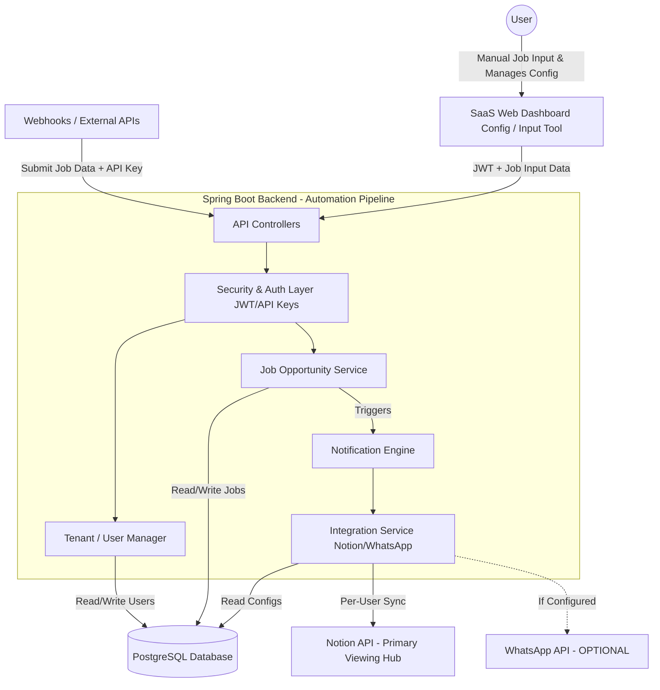
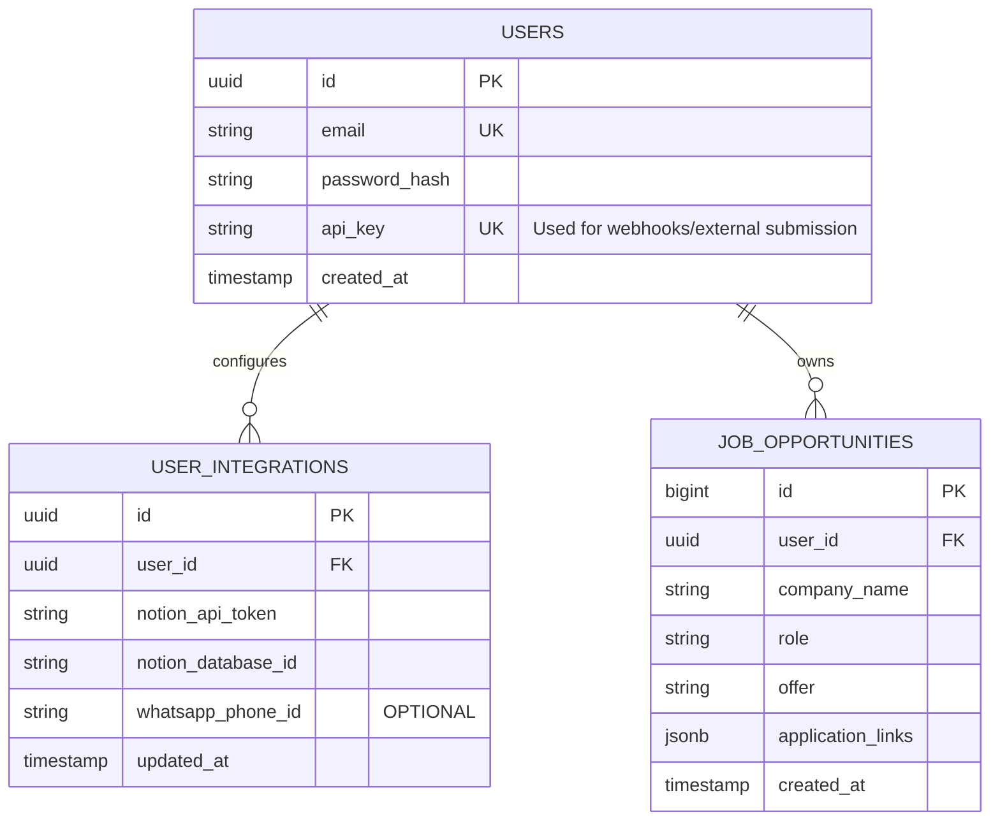

# Architecting "Placement Automation" as a SaaS

This document outlines the architectural transition plan to convert the existing backend job application automation system into a scalable, multi-tenant Software-as-a-Service (SaaS) platform. 

> [!NOTE]
> This plan focuses **exclusively on the backend automation pipeline**. The SaaS platform acts as an engine that takes job inputs, syncs them to Notion (where jobs are permanently viewed), and triggers optional WhatsApp notifications.

## 1. High-Level System Architecture

The new architecture introduces a multi-tenant Spring Boot backend alongside a simple Web Dashboard. The Dashboard serves strictly as a configuration panel and a **manual input tool (acting like a WhatsApp chat / Postman interface)** to submit jobs directly to the pipeline.

---

## 2. Core Feature: The Dashboard Sandbox (Postman / WhatsApp Alternative)

The Web Dashboard will **not** be used to view or track jobs (Notion remains the sole interface for that). Instead, the Dashboard is a utility panel for the user to interact with their backend.

### Dashboard Modules
1. **Manual Job Input (The "WhatsApp/Postman" Interface)**: A simple text box or form where the user can manually paste job details (company, role, criteria, etc.) and hit "Send" to trigger their backend pipeline. 
   - *Why?* If a user doesn't want to use the actual WhatsApp bot, they can use this web interface to "message" the backend exactly the same way. It also serves as a Postman-like testing sandbox.
2. **Integration Settings**: Forms for users to input their Notion API Token and Database ID. Actual WhatsApp credentials can also be added here but are purely optional.
3. **API Keys**: View and regenerate the personal `x-api-key` required for any external webhooks to securely post data to their account.

---

## 3. Database Design (Multi-Tenancy)

We will adopt a **Shared Database, Shared Schema** multi-tenancy model for the backend. Every operational table will include a `user_id` column to isolate data.

### Entity Relationship Diagram

---

## 4. Backend Implementation (Spring Boot)

### Security & Authentication
> [!IMPORTANT]
> The backend will support two forms of authentication: JWT for the Web Dashboard, and static API Keys for external job submissions.

- **Dashboard Auth (JWT)**: For users logging into the web dashboard.
- **Webhook Auth (API Keys)**: For any external system to post jobs using the `x-api-key` header.
- **Tenant Context**: A `TenantContextHolder` will store the identified user's ID for the duration of the request.

### Conditional Notification Engine
Currently, WhatsApp is a hard requirement in the code.
- **Graceful Degradation**: Update the `WhatsAppService` to check if the `whatsapp_phone_id` is null or empty for the current user. If it is, skip the WhatsApp API call without throwing an error. The job is still safely synced to Notion.

---

## 5. Security & Privacy Considerations

- **Encryption at Rest**: Implement an `AttributeConverter` in JPA to encrypt the `notion_api_token` and `whatsapp_phone_id` before saving to the database, and decrypt them upon retrieval using an application-level secret key (e.g., `AES-256`).
- **Data Isolation**: Ensure all JPA repositories enforce the `user_id` filter. E.g., `findByUserIdAndId(Long userId, Long jobId)`.

---

## 6. Open Questions for You

Before proceeding with any code execution, I need your input on the following:

> [!WARNING]
> 1. **Migration Strategy**: What should we do with the data currently in your live PostgreSQL database? Should I write a migration script to assign all existing jobs to a primary "Admin" user (you)?
> 2. **Dashboard Tech Stack**: What framework do you want to use for the new Web Dashboard (e.g., React, Next.js, or plain HTML/JS)?
