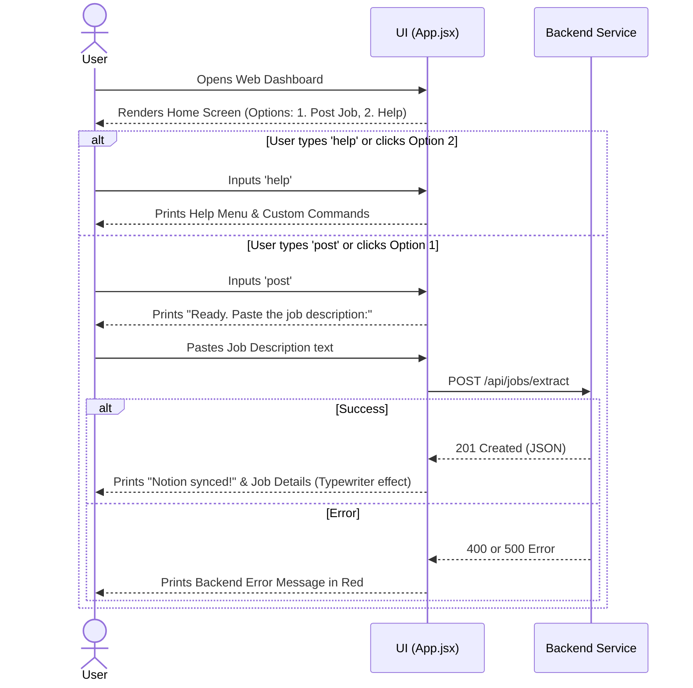
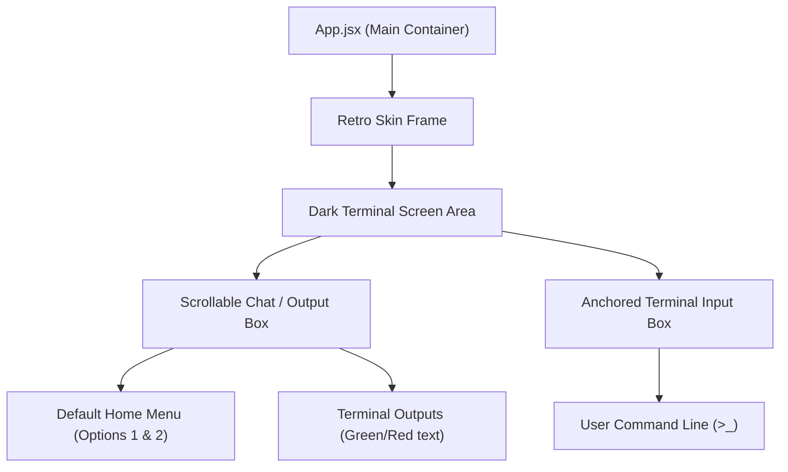

# Retro Terminal Dashboard Implementation Plan

This document outlines the architecture, layout, and implementation steps for building the web-based frontend dashboard, based on the provided wireframes and "OpenClaw / Claude Code" modern-retro terminal aesthetic.

## Design Concept: Modern Retro Terminal
The UI will mimic a sophisticated terminal interface (like Claude Code or a premium hacker terminal) wrapped in a retro hardware skin.

- **Outer Shell**: A distinct "Retro Skin" (e.g., olive green or industrial metallic border) wrapping the inner screen.
- **Inner Screen**: A dark, glowing terminal area.
- **Home/Welcome State**: When the user first opens the app, they see a welcome message and two distinct options (clickable buttons or terminal commands they can type):
  1. `[1] Start posting job application`: Enters the job parsing mode.
  2. `[2] Help`: Displays information on what the bot does and lists custom terminal commands.
- **Persistent Input**: The terminal prompt input (e.g., `>_`) is always anchored at the bottom, ready to accept commands or pasted job descriptions.

## Frontend Architecture & Data Flow

### Component Structure

## Proposed Changes

### 1. Initialization
- Scaffold project: `npx -y create-vite@latest frontend-dashboard --template react` in the root workspace.
- Clear default Vite CSS and setup our custom styles.

### 2. Styling (`index.css`)
- **Retro Skin**: Define a CSS class for the thick, colored outer border (industrial green or dark grey).
- **Terminal Aesthetics**: Deep black background (`#0d0d0d`), monospace fonts (`VT323` or `Fira Code`), and glowing green text (`#00ff00`).
- **Layout**: Use CSS Flexbox/Grid to keep the `ChatLog` scrollable in the center and the `PersistentInput` strictly pinned to the bottom.

### 3. Core Logic (`App.jsx`)
- **State**: `chatHistory` (array of objects), `currentMode` (enum: `'MENU'`, `'AWAITING_JOB'`, `'PROCESSING'`).
- **Command Parser**: Create a function to interpret what the user types in the persistent input:
  - If they type `help`, push the help text to `chatHistory`.
  - If they type `start` or `1`, set `currentMode` to `'AWAITING_JOB'`.
  - If `currentMode` is `'AWAITING_JOB'` and they paste text, send it to `/api/jobs/extract`.
- **API Integration**: Use standard `fetch` to talk to `http://localhost:8080/api/jobs/extract` and handle the 201, 400, and 500 HTTP status codes seamlessly.

## Verification Plan
1. Start `npm run dev`.
2. Ensure the "Retro Skin" and anchored terminal layout exactly match the wireframe concept.
3. Test the "Home" state: Verify the two options render correctly.
4. Type `help` and verify the help menu prints out.
5. Select the "post job" option, paste a description, and verify the backend integration works and returns the simulated WhatsApp error messages or success JSON correctly.
